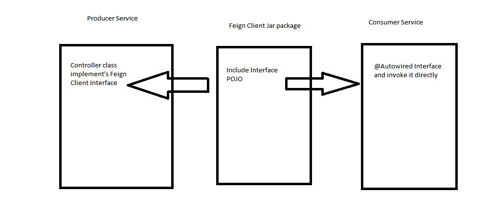

## 1. eureka server 8761

## 2. create a service-hi-client

## 3. create service-hi,port=8762,register to 8761, and the controller implements service-hi-client interface

## 4. create service-feign port=8765, in controller autowired service-hi-client interface , and invoke the service-hi's controller directly

## 5. The very importante is I think the interface must be provided by producer service side, consumer just dependency by maven, and autowired in controller.

## http://localhost:8765/hi?name=sdf
## http://localhost:8761/
## http://localhost:8762/hi?name=m

